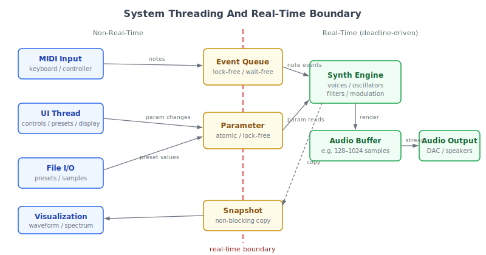

# Control And Audio Rate Processing

Digital synthesizers process information at different rates depending on the precision and speed required. Understanding these rate distinctions is essential for designing a modulation system that sounds smooth, performs efficiently, and behaves predictably across different parameter types.

## Audio Rate

Audio-rate processing computes a new value for every individual sample in the output stream. At a sample rate of 48 kHz, this means 48000 calculations per second for each audio-rate process.

Why it matters:

Audio rate is required whenever the signal is the audio itself. Oscillators produce audio-rate output because their waveforms are the sound. Filters process at audio rate because they reshape the spectral content of each sample. Amplitude scaling operates at audio rate because it directly determines the instantaneous level of the signal.

Audio rate is also required when modulation needs to be fast enough to produce audible sidebands. Audio-rate frequency modulation creates new spectral content that would not exist if the modulation happened at a slower rate. Ring modulation, filter FM, and oscillator sync all depend on sample-by-sample interaction between signals. If these processes ran at a lower rate, the resulting timbres would be incorrect or absent entirely.

Common audio-rate processes in a synthesizer include oscillator waveform generation, filter coefficient application, amplitude envelope multiplication, waveshaping and distortion, ring modulation between two oscillators, and comb filtering. Each of these processes either produces the audio signal directly or modifies it in ways that are perceptible at every sample.

The defining characteristic of audio-rate processing is that it cannot be approximated without changing what the listener hears. A pitch value that updates only once per block will sound like a staircase rather than a smooth glide. A filter that updates its coefficients once per block will miss the spectral effects of fast modulation.

Musical importance:

Anything perceived as pitch, timbre, or continuous spectral content needs audio-rate precision. When a listener hears a tone, they are hearing the result of audio-rate computation. When they hear a filter sweep creating new resonances, those resonances exist because the filter coefficients changed at every sample.

Design implication:

The synthesizer must guarantee audio-rate processing for its entire core signal path. Any attempt to reduce oscillator, filter, or amplitude computation below audio rate will compromise the fundamental character of the sound.

## Control Rate

Control-rate processing computes a new value once per block of samples rather than once per sample. A block might be 32, 64, or 128 samples long. At a sample rate of 48 kHz with a block size of 64, control rate updates happen 750 times per second.

Why it matters:

Many parameters change slowly enough that updating them every sample is unnecessary. A slow LFO cycling at two hertz does not need 48000 updates per second to describe its shape accurately. An envelope that takes half a second to decay does not change meaningfully between consecutive samples. Macro knob movements from a performer happen at human speed, far slower than audio rate.

Control-rate processing dramatically reduces the computational cost of these slow-moving parameters. A modulation path that runs at control rate with a block size of 64 uses roughly one sixty-fourth of the processing power that the same path would use at audio rate. When a synthesizer has dozens of modulation connections across multiple voices, this savings determines how many voices can play simultaneously.

Control rate is sufficient for slow LFO modulation, gradual envelope changes applied to non-critical paths, global parameter adjustments, macro parameter changes, and any modulation where the rate of change is well below the audible range. It is also appropriate for visual feedback calculations such as meter levels, waveform display updates, and spectrum analyzer snapshots, which do not need sample-level precision and can tolerate the latency of block-rate updates.

The tradeoff is precision. A control-rate parameter holds a single value for the duration of one block. If that value changes significantly between blocks, the result is a stepped signal rather than a smooth one. This stepping can be audible as zipper noise or clicking, depending on the parameter and the speed of change.

Design implication:

The choice of block size directly affects control-rate resolution. Smaller blocks give more frequent control-rate updates and finer control precision, but they increase the overhead of per-block bookkeeping and reduce the efficiency advantage over audio rate. Larger blocks save more processing but produce coarser control-rate behavior that requires more aggressive smoothing. The synthesizer should choose a block size that balances latency, control resolution, and processing efficiency.

## Event Rate

Event-rate processing happens at specific trigger points rather than on a continuous schedule. Events include note-on, note-off, sustain pedal changes, program changes, clock ticks, pitch bend resets, and similar discrete messages.

Why it matters:

Events happen irregularly and infrequently compared to audio or control rate. A performer might trigger ten notes per second during fast playing, but this is still thousands of times less frequent than audio-rate processing. Events carry information that is meaningful only at the moment they arrive: a velocity value is set once when a note begins, not recalculated every sample.

Voice allocation happens at event rate. When a note-on arrives, the synthesizer assigns a voice, sets initial parameter values, and triggers envelopes. This decision happens once per note, not continuously. Envelope triggering is an event-rate operation: the gate signal that starts an envelope comes from a note-on event, and the release comes from a note-off event.

Processing events at audio rate would waste resources because nothing changes between events. Processing events at control rate could cause problems if an event arrives between control-rate updates and its timing is quantized to the next block boundary. The distinction between event rate and control rate matters most for timing-sensitive operations.

Some parameters are naturally event-rate even though they might seem continuous. Pitch bend is an example: while a pitch bend message stream can arrive rapidly during a wheel sweep, each individual message is a discrete event with a specific value, not a continuously computed signal. The synthesizer receives the event, updates the pitch bend state, and the audio-rate pitch computation uses that state until the next event arrives. Aftertouch behaves similarly: each pressure update is a discrete event, even though the underlying physical gesture is continuous.

Musical importance:

Pedal events, program changes, and clock sync messages all operate at event rate. A sustain pedal needs to affect voices at the moment it is pressed or released, not at the next block boundary. Clock ticks need accurate timing to maintain synchronization with external gear.

Design implication:

The event-handling system should timestamp incoming events with sample accuracy and queue them for processing within the correct block. Events should not be dropped, reordered, or delayed beyond the block in which they arrive. The architecture should ensure that event processing is separate from the continuous audio and control-rate pipelines, with clear handoff points where event data enters the per-voice state.

## Smoothing Between Rates

When a parameter changes at control rate but needs to be applied at audio rate, the value must be interpolated between updates to avoid stepping artifacts.

Why it matters:

Without smoothing, a parameter that changes once per block creates a staircase pattern. The value holds steady for the duration of one block, then jumps to a new value at the next block boundary. If that parameter controls gain, the jumps produce clicks. If it controls filter cutoff, the jumps produce zipper noise. If it controls pitch, the jumps create a quantized glide instead of a smooth portamento.

Linear interpolation between control-rate updates is the most common smoothing method. The interpolator knows the current value and the target value, and it produces a straight ramp between them over the duration of one block. This is computationally cheap and eliminates the worst stepping artifacts. More sophisticated approaches include exponential smoothing, which produces a curve that approaches the target asymptotically, and polynomial interpolation, which can match the shape of the source signal more closely.

The difference between these methods is audible in certain situations. Linear interpolation can produce corner artifacts at block boundaries where the ramp direction changes abruptly. Exponential smoothing avoids corners but can feel sluggish for parameters that need to track rapid changes. The choice depends on the destination parameter and the expected speed of modulation.

The smoothing time matters. Too little smoothing and the steps are still audible. Too much smoothing and fast parameter changes feel sluggish or delayed. The appropriate smoothing behavior depends on the parameter: filter cutoff benefits from short smoothing that eliminates clicks but preserves responsiveness, while a reverb mix parameter can tolerate longer smoothing because rapid changes to reverb mix are rarely musically useful.

Smoothing is the critical bridge between efficiency and quality. It allows the modulation system to compute values at control rate while delivering audio-rate results that sound continuous.

Design implication:

Every parameter that accepts control-rate modulation and feeds into the audio path should have a defined smoothing policy. The policy should specify the interpolation method and the smoothing duration. Parameters where instantaneous jumps are musically intended, such as hard pitch quantization or gated effects, should be explicitly marked as unsmoothed rather than left unsmoothed by accident.

## Modulation Rate Decisions

Choosing the correct rate for each modulation path is a design decision that affects both sound quality and performance.

Why it matters:

Wrong rate decisions produce either wasted processing power or audible artifacts. A slow-moving parameter running at audio rate wastes computation without improving sound. A fast-moving parameter running at control rate without adequate smoothing produces stepping artifacts.

Guidelines for common modulation paths:

LFO to pitch requires audio rate when the LFO frequency is high enough to function as frequency modulation. At slow speeds, LFO pitch modulation is vibrato. At fast speeds, it creates FM sidebands. If the LFO is restricted to slow speeds, control rate with smoothing is sufficient, but a general-purpose LFO that can sweep from sub-hertz to audio range should support audio-rate output.

Envelope to amplitude should be audio rate. Amplitude envelopes with fast attack or release stages produce clicks if they update only at block boundaries. Even moderate envelope speeds benefit from audio-rate precision because the ear is sensitive to amplitude discontinuities.

LFO to filter cutoff should be audio rate when the LFO is fast enough to create audible tones through the filter. A slow filter sweep can use control rate with smoothing, but a fast LFO modulating cutoff at tens of hertz or more produces audible artifacts at control rate.

Macro to effect mix is usually sufficient at control rate because macro changes are performer-driven and happen at human speed. Smoothing prevents clicks but the update rate does not need to be per-sample.

Velocity to any destination is event rate because velocity is determined once when a note begins and does not change during the note.

Design implication:

The modulation routing system should tag each connection with its intended rate. This allows the audio engine to schedule processing correctly and avoids situations where a control-rate path accidentally runs at audio rate or an audio-rate path is mistakenly downsampled. A clear rate tag also helps with debugging: if a modulation path sounds stepped, checking its rate assignment is the first diagnostic step.

## Sample-Accurate Timing

Some events need to happen at a precise sample position within a block, not at the block boundary.

Why it matters:

When events are quantized to block boundaries, they can be displaced in time by up to one block duration. At a block size of 128 samples and a sample rate of 48 kHz, this displacement is up to 2.7 milliseconds. While this may sound small, it is enough to affect the feel of rhythmic performance.

Note-on events aligned to the exact sample where the message arrived produce tighter rhythmic accuracy. If all note-on events snap to the start of the next block, rapid sequences and tight grooves acquire a subtle looseness that was not in the original performance. Instruments used for percussive sounds are especially sensitive to this timing jitter.

Modulation changes that need to coincide precisely with audio events also benefit from sample-accurate triggering. An envelope that starts exactly at the sample where the note-on occurred produces a cleaner attack than one that starts at the next block boundary. Hard sync resets and retrigger events are similarly sensitive to sub-block timing.

Achieving sample-accurate timing requires splitting a block at the point where an event occurs, processing the portion before the event with the old state, then processing the remainder with the new state. This increases complexity but produces measurably tighter performance response.

Design implication:

The audio engine should support sub-block processing for event handling. Rather than processing the entire block as a unit and applying events at the boundaries, the engine should accept a sorted list of timestamped events and split processing around them. This is particularly important for a synthesizer that aims to feel responsive as a playable instrument, not just as a sound generator.

## CPU Cost Implications

Audio-rate processing costs proportionally more than control-rate processing because it runs for every sample in every block.

Why it matters:

A modulation path running at audio rate with a block size of 64 performs 64 times as many calculations as the same path running at control rate. If a synthesizer has eight voices, each with four modulation paths, switching those paths from control rate to audio rate multiplies the modulation cost by the block size.

Unison deepens this cost further. A patch with four-voice unison and eight-note polyphony has 32 simultaneous voice instances. Every audio-rate modulation path runs 32 times. Rate decisions that seem minor for a single voice become significant when multiplied across a full polyphonic, unison configuration.

The CPU budget for audio processing is fixed by the sample rate and block size. The synthesizer must complete all computation for one block before the audio system requests the next block. If processing exceeds this deadline, the result is an audible glitch. Rate decisions directly affect how many voices, oscillators, filters, and modulation paths can run simultaneously without exceeding the deadline.

This makes rate assignment a performance decision as much as a quality decision. The goal is to use audio rate only where it produces an audible difference, and control rate everywhere else.

Design implication:

The synthesizer should track its CPU usage relative to the block deadline and expose this information to the user. Understanding the processing budget helps users make informed decisions about patch complexity, voice count, and quality settings. The architecture should also allow rate decisions to be adjusted as a quality-versus-performance tradeoff, so that a computationally expensive patch can be lightened by switching non-critical modulation paths from audio rate to control rate.

## Design Recommendations For Digital Synth

Oscillators, filters, and amplitude processing should always operate at audio rate. These are the core signal path and their output is the audio itself.

Envelopes should be audio rate for amplitude and filter paths where fast changes produce audible artifacts. For slower modulation targets such as effect parameters, panning, or secondary timbral adjustments, control-rate envelopes with smoothing are acceptable.

LFOs should support both audio rate and control rate. When an LFO is used for standard modulation at low frequencies, control rate with smoothing is efficient and sufficient. When the same LFO is swept into audio-range frequencies for FM-like effects, it must switch to audio-rate output to produce correct sidebands.

All control-rate paths need smoothing to prevent zipper noise and clicking. The smoothing method and time should be appropriate to the parameter: fast smoothing for responsive controls, slower smoothing for parameters where rapid changes are not musically useful.

Event timing should be sample-accurate for note events. Voice allocation, envelope triggering, and gate changes should happen at the exact sample position of the incoming event rather than being quantized to the next block boundary.

The architecture should make rate assignment configurable per modulation path, not fixed per source. An LFO is not inherently audio rate or control rate. Its required rate depends on where it is routed and how fast it runs. The modulation system should allow the same source to operate at different rates depending on the destination and the musical context.

Rate assignment should be transparent to the user where possible. The system can select an appropriate rate based on the source frequency range and the destination sensitivity, but advanced users should be able to override these defaults. A quality setting that shifts borderline paths from control rate to audio rate gives users control over the tradeoff between CPU usage and modulation fidelity.

The three rates described in this document, audio, control, and event, form a hierarchy that governs all processing in the synthesizer. Keeping this hierarchy explicit in the architecture prevents the kind of subtle bugs where a path runs at the wrong rate and produces artifacts that are difficult to diagnose. Every signal path, modulation connection, and parameter update should have a clearly defined rate, documented and enforced by the system design.
