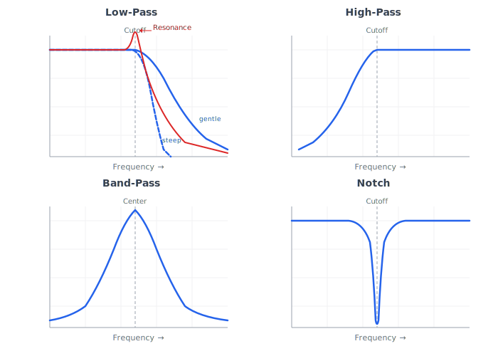

# Filters And Tone Shaping

Filters and tone-shaping stages sculpt the spectrum and character of a synthesizer sound. In subtractive synthesis, they are central to the instrument.

## Filter

A filter changes the level of different frequency ranges.

Why it matters:

- It shapes brightness, warmth, thinness, weight, and motion.
- It turns harmonically rich oscillators into musically articulated sounds.
- It is one of the most important modulation destinations.

Musical importance:

A static oscillator can sound plain. A moving filter can make the same oscillator feel like a pluck, swell, brass stab, bass, pad, or rhythmic pulse.

## Cutoff Frequency

Cutoff frequency is the main frequency boundary where the filter begins changing the signal.

Why it matters:

- It is the primary tone control for many filter types.
- Moving cutoff changes perceived brightness.
- Cutoff is often controlled by envelopes, LFOs, velocity, key tracking, and macros.

Design implication:

Cutoff should be smoothed when controlled continuously. Abrupt cutoff changes often create zipper noise or clicks.

## Resonance

Resonance emphasizes frequencies near the cutoff.

Why it matters:

- Adds character and focus.
- Makes filter movement more audible.
- Can create whistle-like tones.
- Some filters self-oscillate at high resonance.

Musical importance:

Low resonance is smooth. Moderate resonance adds bite. High resonance can become acidic, nasal, or screaming.

Design implication:

Resonance should have musically useful scaling and safe gain behavior. High resonance can create level spikes.

## Filter Slope

Filter slope describes how steeply a filter attenuates frequencies past the cutoff. It is often described in decibels per octave.

Common slopes:

- Gentle slopes preserve more surrounding tone.
- Steeper slopes create stronger separation.

Why it matters:

Slope strongly changes character. A gentle low-pass can sound open and natural. A steep low-pass can sound more electronic and controlled.

Design implication:

If multiple slopes are supported, they should be exposed as musical choices rather than hidden technical variants.

## Low-Pass Filter

A low-pass filter keeps low frequencies and reduces high frequencies.

Sound character:

- Darkens sound as cutoff moves down.
- Smooths bright oscillators.
- Common in subtractive synthesis.

Common uses:

- Bass shaping.
- Pad sweeps.
- Pluck articulation.
- Brass-like attacks.
- Removing harshness.

Design implication:

Low-pass filtering should be part of the first subtractive architecture.

## High-Pass Filter

A high-pass filter keeps high frequencies and reduces low frequencies.

Sound character:

- Thins sound.
- Removes rumble.
- Creates airy or brittle tones.
- Can make space in a mix.

Common uses:

- Thin pads.
- Noise effects.
- Risers.
- Removing low-end buildup.
- Layering.

Design implication:

High-pass filtering is important for mix control and sound design, though low-pass is usually the first subtractive priority.

## Band-Pass Filter

A band-pass filter keeps a range of frequencies and reduces frequencies above and below it.

Sound character:

- Focused.
- Vocal.
- Nasal.
- Resonant.

Common uses:

- Formant-like sounds.
- Sweeps.
- Percussion.
- Effects.
- Thin leads.

Design implication:

Band-pass mode helps a synth create specialized tones without adding new oscillators.

## Notch Filter

A notch filter removes a narrow band of frequencies.

Sound character:

- Hollow.
- Phasey.
- Moving notches can sound like phasing.

Common uses:

- Special effects.
- Removing resonances.
- Animated motion.

Design implication:

Notch filtering is useful but not required for the earliest version.

## Comb Filter

A comb filter creates repeated peaks and notches across the spectrum, usually through short delay and feedback.

Sound character:

- Metallic.
- Hollow.
- Flanged.
- Resonant.
- String-like in some settings.

Common uses:

- Physical-modeling-like tones.
- Flanging.
- Resonator effects.
- Metallic percussion.

Design implication:

Comb filtering belongs in advanced tone shaping or effects. It can become unstable with feedback and needs careful gain handling.

## State-Variable And Multimode Filters

A multimode filter can provide several outputs or modes such as low-pass, high-pass, band-pass, and notch.

Why it matters:

- Gives more sound-design range from one conceptual filter.
- Makes filter mode a performance or preset choice.

Design implication:

A multimode filter is a good long-term design target, but the conceptual model should start with clear individual filter behaviors.

## Filter Topology

Filter topology refers to the arrangement and feedback structure of a filter's internal stages. Two filters can share the same cutoff frequency, resonance setting, and slope yet sound noticeably different because of how their stages are connected, where feedback is introduced, and how signals combine at each point in the structure.

Topology determines several musical qualities: how resonance interacts with the signal's overall level, how smoothly the filter transitions between passband and stopband, how the filter responds to transients, and how it behaves at extreme settings. These qualities give a filter its character, which is why musicians often describe filters by their topology name rather than by their technical specifications.

Why it matters:

- It is the primary reason different synthesizers with the same filter type can sound so different from each other.
- It shapes the sonic identity of an instrument more than almost any other single design choice.
- Choosing a topology is a musical decision, not just a technical one.

Musical importance:

A ladder topology and a state-variable topology set to the same low-pass cutoff and resonance will produce recognizably different timbres. The choice of topology defines the instrument's tonal personality across every patch that uses the filter.

Design implication:

The project should treat topology as a first-class design parameter. When multiple filter characters are offered, exposing topology as a user-facing choice gives sound designers meaningful control over the instrument's fundamental voice.

## Ladder Filter Character

A ladder filter is a topology built from a cascade of matched stages, each contributing a portion of the total slope, with a global feedback path from the output back to the input. It is historically associated with early analog subtractive synthesizers and remains one of the most recognized filter sounds.

The defining musical trait of a ladder filter is that its resonance draws energy from the signal passing through it. As resonance rises, the bass content of the output decreases. This bass loss gives the ladder its characteristic sound: resonance adds a focused, singing peak while the body of the sound thins out, creating a clear separation between the resonant emphasis and the underlying tone.

Why it matters:

- It is the reference sound for classic subtractive synthesis. Many musicians expect a subtractive synthesizer to offer this character.
- The bass-loss behavior is musically distinctive. It naturally prevents muddiness at high resonance but can also require compensation if a full low end is needed.
- Its smooth, warm rolloff and predictable resonance curve make it forgiving across a wide range of patches.

Musical importance:

Acid bass lines, sweeping pads, plucked leads, and many foundational subtractive sounds were shaped by ladder character. It remains a benchmark that players compare other filters against.

Design implication:

A ladder-character filter is a strong candidate for the project's first filter voice. If offered alongside other topologies, the bass-loss trait should be preserved rather than corrected away, since it is central to the musical identity. Any optional bass compensation should be a separate, clearly labeled control.

## State-Variable Filter Depth

A state-variable filter is a topology that produces multiple simultaneous outputs from a single structure: low-pass, high-pass, band-pass, and notch. Rather than designing separate circuits or processes for each mode, the state-variable arrangement derives all of them at different points in the same signal flow.

Resonance in a state-variable filter typically behaves differently from a ladder. Instead of reducing bass content as resonance increases, a state-variable filter tends to preserve the overall frequency balance while adding a resonant peak. This means that at high resonance, the sound retains its body and weight while the peak becomes more pronounced.

Why it matters:

- It provides maximum flexibility from a single filter structure, making it natural for multimode designs.
- The resonance behavior makes it well suited for sounds that need both strong resonance and full bass, such as heavy bass patches and thick pads.
- Smooth morphing between filter modes is more straightforward because all outputs share the same internal state.

Musical importance:

The ability to crossfade or switch between low-pass, high-pass, band-pass, and notch from one filter gives a sound designer far more tonal range per voice. The bass-preserving resonance character suits modern electronic music styles that demand weight and presence alongside filter movement.

Design implication:

A state-variable topology is a strong candidate for the project's multimode filter. It should expose mode selection or continuous mode morphing as a user-facing control. The resonance behavior difference from a ladder should be documented for users so they understand why the two topologies feel different at similar settings.

## Self-Oscillation

Self-oscillation occurs when a filter's resonance is raised high enough that the feedback within the filter sustains a continuous pitched tone, even with no input signal. The filter effectively becomes an oscillator, producing a clean or near-clean sine-like waveform at the cutoff frequency.

The pitch of a self-oscillating filter follows the cutoff control. When key tracking is set to full, the filter's self-oscillation pitch tracks the keyboard, allowing the filter to function as an additional pitched voice. This can be used for sine-like bass tones, melodic whistles layered over the main oscillators, or special effects where the filter's pitch sweeps independently.

Why it matters:

- It extends the instrument's sound palette without adding a dedicated oscillator.
- It enables specific musical techniques: acid bass lines often rely on self-oscillation at the edge of feedback, pitched filter drops use it for dramatic sweeps, and experimental patches use it as a tonal element.
- It defines a boundary in the resonance range that has both creative potential and safety concerns.

Musical importance:

A filter that can self-oscillate offers a wider expressive range. A filter that cannot may feel limited to players accustomed to analog-style instruments. The transition zone just below self-oscillation, where resonance is very high but not yet sustaining, is itself a musically rich area.

Design implication:

The project should support self-oscillation as a deliberate feature rather than an accidental byproduct. Gain management around the self-oscillation threshold is essential: the output level can spike dramatically, so limiting or soft clipping after the filter stage protects both the signal chain and the listener. The resonance control's scaling should place the self-oscillation threshold at a predictable and accessible point.

## Filter Frequency Modulation

Filter frequency modulation means using an audio-rate signal, such as an oscillator, to modulate the filter's cutoff frequency. This is distinct from modulating cutoff with an envelope or LFO, which operate at sub-audio rates and produce smooth, predictable sweeps. Audio-rate modulation is fast enough to create new frequency components, called sidebands, that do not exist in either the original signal or the modulating signal alone.

The resulting sound is often metallic, harsh, clangorous, or aggressive, depending on the modulation depth and the frequency relationship between the modulator and the cutoff. At shallow depths, it adds a subtle animation or shimmer. At deep settings, it can radically transform the timbre into something inharmonic and bell-like or noisy and chaotic.

Why it matters:

- It opens timbral territory that static or slowly modulated filters cannot reach.
- It bridges subtractive and modulation synthesis, giving a subtractive instrument access to FM-like textures without requiring a full FM engine.
- It is a powerful tool for aggressive sound design, industrial textures, and experimental patches.

Musical importance:

Audio-rate filter modulation can produce sounds ranging from subtle grit to extreme metallic transformation. It is particularly valued in genres that prize aggressive or unusual timbres, and it adds depth to an instrument that might otherwise be limited to smooth subtractive tones.

Design implication:

If supported, filter frequency modulation should be clearly labeled and controlled. The modulation source, depth, and polarity should all be exposed. Because audio-rate modulation of a filter can produce frequency content above the audible range, aliasing is a design-level concern that should be addressed when implementation begins. A safe default depth and clear documentation will help users explore this feature without immediately producing harsh artifacts.

## Zero-Delay Feedback

Zero-delay feedback is a design concept where a filter's output is available to its own feedback path within the same computational step, rather than using a delayed version of the output. In any system that processes audio in discrete steps, there is a natural tendency for the feedback signal to arrive one step late. Zero-delay feedback describes approaches that resolve this delay so the filter behaves as though input and feedback are truly simultaneous.

The musical consequence of this concept is most apparent at high resonance and during self-oscillation. When feedback is delayed even slightly, the resonant peak drifts in pitch and the filter's self-oscillation may not track the cutoff frequency accurately. With zero-delay feedback, resonance is tighter, self-oscillation pitch is more precise, and the overall filter response more closely matches the behavior of analog filters where feedback is inherently instantaneous.

Why it matters:

- It is the primary factor in whether a filter sounds convincingly analog at high resonance settings.
- It determines how accurately a self-oscillating filter tracks pitch across the keyboard.
- It affects the perceived tightness and musicality of resonance at all settings, not just extremes.

Musical importance:

Players working with self-oscillating filters or high-resonance sounds will hear the difference immediately. Accurate pitch tracking during self-oscillation is essential for using the filter as a melodic element. Even at moderate resonance, zero-delay feedback produces a more solid and focused resonant character.

Design implication:

The project should treat zero-delay feedback as a quality benchmark for its filter models. It is a design-level commitment to analog-accurate behavior rather than an optional enhancement. When filter quality is evaluated during development, resonance accuracy and self-oscillation pitch tracking should be primary test criteria.

## Key Tracking

Key tracking changes filter cutoff based on note pitch.

Why it matters:

- Higher notes often need higher cutoff to remain bright.
- It can make filter resonance track pitch.
- Full key tracking can make a self-oscillating filter play melodies.

Musical importance:

Without key tracking, a patch may sound bright in the low register but dull in the high register, or the reverse.

Design implication:

Key tracking should be a standard modulation source or dedicated filter control.

## Velocity To Filter

Velocity-to-filter mapping changes cutoff or envelope amount based on how hard a note is played.

Why it matters:

- Adds articulation.
- Mimics acoustic instruments where harder playing often produces brighter sound.
- Makes patches feel responsive.

Design implication:

Velocity should be routable to filter cutoff and filter envelope amount.

## Filter Envelope

A filter envelope moves cutoff or another filter parameter over the life of a note.

Why it matters:

- Creates plucks.
- Creates brass-like openings.
- Creates percussive brightness.
- Shapes attacks and releases.

Design implication:

The first subtractive architecture should include a dedicated filter envelope or a general envelope that can be routed to cutoff.

## Drive And Saturation

Drive increases signal level into a nonlinear stage. Saturation softens or colors peaks by adding harmonics.

Why it matters:

- Adds warmth, grit, density, or aggression.
- Can make filters sound more characterful.
- Changes perceived loudness and brightness.

Design implication:

Drive should be intentional and gain-managed. If placed before the filter, it changes what the filter receives. If placed after the filter, it colors the filtered result.

## Waveshaping

Waveshaping uses a nonlinear curve to transform the waveform.

Why it matters:

- Creates harmonics and complex timbres.
- Can produce distortion, folding, clipping, or asymmetry.

Design implication:

Waveshaping can alias strongly, so quality modes or oversampling should be considered when implementation begins.

## Wavefolding

Wavefolding folds a waveform back on itself when it exceeds a threshold.

Sound character:

- Bright.
- Complex.
- Metallic.
- Aggressive.
- Often associated with West Coast synthesis.

Design implication:

Wavefolding is powerful but should be introduced after the basic subtractive path is stable.

## Equalization

EQ changes frequency balance using bands rather than acting as the primary musical filter.

Why it matters:

- Helps fit patches into a mix.
- Can correct excessive low-end, harshness, or muddiness.

Design implication:

EQ belongs more naturally in the effects or output stage than in the core voice, though both options are possible.

## Common Filter Mistakes

Mistake: Cutoff jumps without smoothing.

Result: Zipper noise or clicks.

Mistake: Resonance causes uncontrolled level spikes.

Result: Harshness, clipping, or listener discomfort.

Mistake: Filter envelope range is poorly scaled.

Result: Most useful sounds occur in a tiny control range.

Mistake: No key tracking.

Result: Patches do not translate well across the keyboard.

Mistake: Filter is treated as a utility rather than a musical control.

Result: The instrument feels static.

## Filter Design Recommendations

For the first architecture:

- Include a low-pass filter as a core component.
- Add cutoff, resonance, envelope amount, key tracking, and velocity influence.
- Design modulation routing so LFOs, envelopes, macros, and performance controls can target cutoff.
- Preserve headroom around resonance.
- Add additional modes after the basic low-pass behavior is clear.

