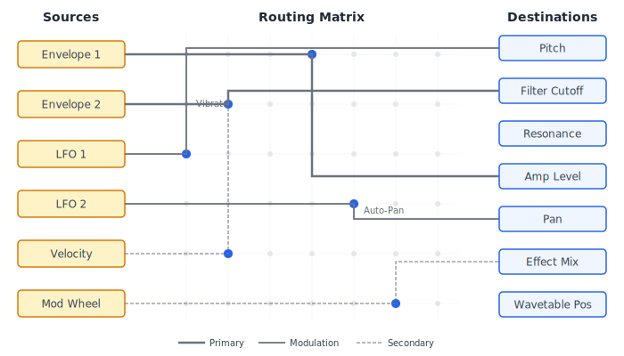
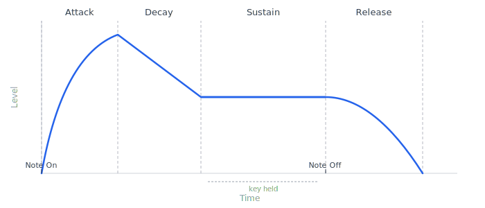
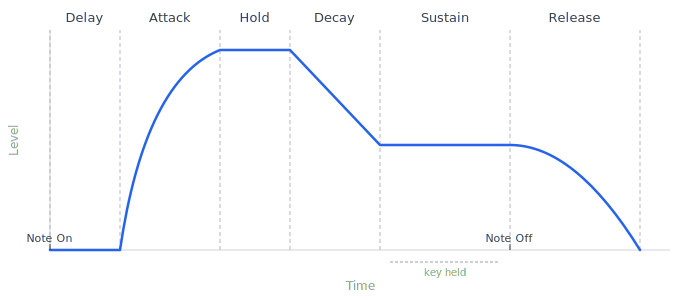
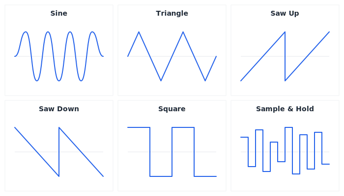

# Modulation And Envelopes

Modulation is the process of changing one parameter with another signal or control source. It is the difference between a static tone and a living instrument.

## Modulation

Modulation means using one value to change another value over time.

Examples:

- An envelope changes volume.
- An LFO changes pitch.
- Velocity changes filter cutoff.
- A macro changes filter cutoff, reverb mix, and oscillator detune at once.
- Pressure changes vibrato depth.

Why it matters:

Most interesting synthesizer sounds depend on movement. Modulation creates articulation, rhythm, expression, instability, and evolution.

## Modulation Source

A modulation source is anything that produces a changing or controllable value.

Common sources:

- Envelope.
- LFO.
- Velocity.
- Key tracking.
- Mod wheel.
- Aftertouch.
- Pitch bend.
- Random value.
- Step sequencer.
- Macro.
- Per-note expression.
- Audio-rate oscillator.

Why it matters:

The quality of a modulation system depends on the usefulness and clarity of its sources.

## Modulation Destination

A modulation destination is a parameter affected by a modulation source.

Common destinations:

- Pitch.
- Oscillator level.
- Oscillator shape.
- Pulse width.
- Filter cutoff.
- Filter resonance.
- Amplifier gain.
- Pan.
- Effect mix.
- Delay time.
- Reverb size.
- Wavetable position.
- FM amount.

Why it matters:

Destinations determine what can move. A synth with many sources but few destinations still feels limited.

## Modulation Depth

Modulation depth is the amount by which a source affects a destination.

Why it matters:

- Small depth creates subtle movement.
- Large depth creates obvious transformation.
- Negative depth can invert a source.

Design implication:

Depth should use destination-aware units where possible. Pitch modulation may be in cents or semitones. Filter modulation may be in octaves or normalized cutoff movement. Gain modulation may need perceptual scaling.

## Modulation Matrix

A modulation matrix is a routing system that connects sources to destinations.

Why it matters:

- It lets users create complex patches without hard-wired limitations.
- It makes the synth extensible.
- It enables expressive performance mappings.

Good modulation matrix behavior:

- Clear source names.
- Clear destination names.
- Visible depth amounts.
- Bipolar and unipolar handling.
- Per-voice and global routing distinction.
- Conflict behavior when many sources affect one destination.
- Visual indication of active modulation.

Design implication:

Digital Synth should make the modulation matrix central rather than hidden. It is one of the main ways the instrument becomes a sound-design laboratory.

## Unipolar And Bipolar Modulation

A unipolar source moves in one direction from a minimum to a maximum. A bipolar source moves around a center point in both directions.

Examples:

- An ADSR envelope is usually unipolar.
- A sine LFO is usually bipolar.
- Velocity is usually unipolar.
- Pitch bend is usually bipolar.

Why it matters:

If the synth treats these carelessly, modulation depth will feel confusing. A unipolar envelope opening a filter is different from a bipolar LFO moving cutoff above and below its base value.

Design implication:

The docs and future interface should show whether a source is unipolar or bipolar.

## Per-Voice Modulation

Per-voice modulation is evaluated separately for each active note.

Examples:

- Each note has its own amplitude envelope.
- Each note has its own filter envelope.
- Each note has independent pressure.
- Each note has an LFO that starts when the note starts.

Why it matters:

Per-voice modulation lets chords articulate naturally. One note can be in attack while another is in release.

## Global Modulation

Global modulation affects the entire instrument at once.

Examples:

- A global LFO sweeps filter cutoff for all voices together.
- A macro raises reverb mix.
- A master volume control changes the whole output.

Why it matters:

Global modulation creates unified movement. It is useful for tempo-synced sweeps, performance macros, and final shaping.

Design implication:

The architecture should support both per-voice and global modulation because they produce different musical results.

## Envelope

An envelope is a time-shaped modulation source, usually triggered by a note or event.

Why it matters:

Envelopes define articulation. They determine whether a sound is percussive, sustained, swelling, fading, plucked, bowed, struck, or droning.

## ADSR Envelope

ADSR stands for attack, decay, sustain, and release.

Attack:

The time it takes to rise from silence or the current level to the peak.

Decay:

The time it takes to fall from the peak to the sustain level.

Sustain:

The level held while the note remains active.

Release:

The time it takes to fade after the note is released.

Why it matters:

ADSR is one of the most important synthesizer concepts because it maps naturally to musical articulation.

Sound examples:

- Short attack, short decay, low sustain, short release: pluck.
- Medium attack, high sustain, medium release: pad.
- Instant attack, full sustain, no release: organ-like tone.
- Fast attack, decay to medium sustain, short release: bass.

Design implication:

The synth should include ADSR behavior early and later consider curve shapes, delay, hold, looping, and velocity scaling.

## Envelope Curves

Envelope curves describe the shape of transitions between stages.

Common curve types:

- Linear.
- Exponential.
- Logarithmic.
- S-curve.

Why it matters:

The same attack time can feel very different depending on curve shape. Exponential curves often sound more natural for amplitude.

Design implication:

Curve shape may be a future advanced control. Even if hidden, the default curve should be chosen musically.

## Delay Stage

The delay stage is an optional envelope phase that inserts a silent waiting period before the attack begins. During the delay period, the envelope outputs its minimum value. Once the delay time elapses, the envelope proceeds into its attack stage normally.

Why it matters:

Delayed envelopes are essential for layered sounds where different components should enter at different times. A pad that layers two oscillators can delay the filter envelope on the second oscillator so it blooms after the first has already established the harmonic foundation. Delayed vibrato envelopes allow pitch modulation to appear gradually after the note onset, mimicking how acoustic performers introduce vibrato after establishing a pitch. Without a delay stage, achieving these effects requires workarounds such as very slow attack curves that waste envelope resolution.

Controls typically exposed:

- Delay time, usually in milliseconds or seconds.
- Tempo sync option, allowing the delay to lock to rhythmic divisions such as eighth notes or quarter notes.

Common mistakes:

Setting a long delay without understanding that the envelope outputs its minimum during the wait, which for a filter envelope means the filter stays at its base cutoff. Confusing envelope delay with audio delay effects. Forgetting that delay is per-voice, so each new note restarts its own delay timer independently.

Design implication:

Digital Synth should support an optional delay stage on all routable envelopes. The delay should be visualized as a flat segment preceding the attack slope so users can see the timing relationship. Tempo sync for envelope delay should share the same clock infrastructure as LFO sync.

## Hold Stage

The hold stage is an optional envelope phase inserted between attack and decay. During the hold period, the envelope maintains its peak level before transitioning into the decay stage. The full sequence becomes delay, attack, hold, decay, sustain, release.

Why it matters:

The hold stage guarantees that the peak level persists for a defined duration regardless of attack and decay settings. This is critical for percussive sounds that need a consistent transient punch. Without a hold stage, a short attack followed by a fast decay may never allow the signal to sit at its peak long enough to be perceived as a sharp hit. The hold stage also matters for brass-like or horn-like sounds where the initial brightness should sustain briefly before the timbre settles.

Controls typically exposed:

- Hold time, usually in milliseconds.
- Tempo sync option for rhythmic hold durations.

Common mistakes:

Setting hold time too long makes transients sound unnatural and blocky. Confusing hold with sustain: hold is a timed phase that always completes, while sustain is a level maintained as long as the note is held.

Design implication:

Digital Synth should include hold as an optional stage on amplitude and filter envelopes. The stage should appear in the envelope visualization between the attack peak and the decay slope. Preset storage must account for the additional parameter.

## Looping Envelopes

A looping envelope repeats some or all of its stages continuously rather than playing through once and stopping. Common loop modes include loop sustain, where the envelope cycles through specified stages while the note is held and then exits to the release stage on note-off; loop all, where the envelope cycles indefinitely regardless of note state; and one-shot, the standard non-looping behavior included for completeness.

Why it matters:

Looping envelopes turn a time-based modulation source into a rhythmic one. A short looping envelope routed to amplitude creates a rhythmic gating effect. A looping envelope on filter cutoff produces evolving timbral patterns. Because the envelope shape can be asymmetric and multi-staged, looping envelopes can generate complex rhythmic motion that a simple LFO cannot replicate. They bridge the gap between envelopes and step sequencers, offering shaped repetition with precise control over each segment.

Controls typically exposed:

- Loop mode selector: one-shot, loop sustain, loop all.
- Loop start point, defining which stage the loop returns to.
- Loop end point, defining where the loop cycles back.
- Tempo sync for loop duration, aligning the full loop cycle to a rhythmic division.

Common mistakes:

Forgetting to define release behavior when using loop sustain mode, which can cause the sound to cut off abruptly. Creating loops with very short total times that produce audio-rate cycling, which is a different effect from modulation-rate looping and can cause aliasing artifacts. Not considering that loop length affects perceived tempo of the modulation.

Design implication:

Digital Synth should treat looping as a mode on multi-segment envelopes rather than a separate envelope type. The visualization should animate the loop cycle so users can see which stages repeat. Tempo sync for loop duration should integrate with the global tempo system.

## Multi-Segment Envelopes

A multi-segment envelope extends beyond the four stages of ADSR to allow an arbitrary number of breakpoints and transitions. Each segment defines a target level and a time to reach it, along with a curve shape for the transition. The envelope becomes a series of connected ramps or curves that can model complex evolving behaviors.

Why it matters:

Four stages are sufficient for many sounds, but complex evolving patches benefit from envelopes that can rise, dip, rise again, plateau, and then decay through multiple phases. A pad sound might need a slow attack to a medium level, a brief swell to a higher peak, a gradual fall to a sustain level, and then a multi-phase release that dims quickly at first and then fades slowly. Sound designers working on cinematic or textural material frequently need this level of control. Multi-segment envelopes also support the looping described above more naturally because there are more segments available to define interesting loop regions.

Controls typically exposed:

- Number of segments, adjustable by adding or removing breakpoints.
- Per-segment target level.
- Per-segment transition time.
- Per-segment curve shape.
- Sustain point marker, identifying which breakpoint acts as the sustain hold.
- Loop region markers when looping is enabled.

Common mistakes:

Creating envelopes with too many segments that become difficult to edit and impossible to understand at a glance. Losing track of which segment serves as the sustain point. Preset portability can suffer when one envelope format expects four stages and another expects an arbitrary number.

Design implication:

Digital Synth should define a flexible envelope format from the beginning, even if the initial interface only exposes ADSR. The underlying data model should support arbitrary breakpoints so that advanced editing can be enabled later without redesigning the preset format. The interface for multi-segment editing should prioritize visual clarity and direct manipulation.

## Velocity-Scaled Envelope Times

Velocity-scaled envelope times means allowing the speed of individual envelope stages to change based on how hard or fast a note is played. Higher velocity can shorten the attack for a snappier transient, or it can shorten the decay for a tighter percussive response. Lower velocity can lengthen the attack for a softer onset.

Why it matters:

Standard velocity sensitivity only affects level, making loud notes louder and soft notes quieter. But real instruments also change their temporal behavior with playing intensity. A hard-struck piano has a faster attack and a different decay profile than a gently played one. A forcefully bowed string reaches full volume faster than a soft stroke. Velocity-scaled envelope times bring this dynamic temporal response to the synthesizer, creating a more expressive and realistic playing experience that goes beyond simple volume scaling.

Controls typically exposed:

- Velocity-to-attack-time amount, typically bipolar so velocity can either shorten or lengthen the attack.
- Velocity-to-decay-time amount, with the same bipolar behavior.
- Velocity-to-release-time amount, less common but useful for sounds that ring longer when played softly.
- Scaling curve, determining whether the relationship between velocity and time change is linear or curved.

Common mistakes:

Applying too much velocity scaling to attack time can make gentle notes feel sluggish. Scaling decay with velocity but not adjusting sustain level can produce unexpected timbral shifts. Forgetting that these scalings interact with base envelope times, so a very short base attack may not have room to get shorter.

Design implication:

Digital Synth should allow velocity to modulate envelope stage times through the modulation matrix rather than hard-wiring velocity-to-time relationships. This keeps the system flexible and visible. The interface should make clear that velocity is affecting time, not just level, because this distinction is often confusing for new users.

## Envelope Followers

An envelope follower is a modulation source that derives its output from the amplitude of an audio signal. It analyzes an incoming sound, detects its volume contour, smooths the result, and produces a control signal that tracks the loudness of the input over time.

The conceptual signal flow is: audio input, then amplitude detection that converts the waveform into a level measurement, then smoothing that controls how quickly the follower responds to changes, and finally output as a modulation source available in the modulation matrix.

Why it matters:

Envelope followers enable reactive modulation where the behavior of one sound controls the shape of another. A kick drum's amplitude can open a filter on a bass patch, creating sidechain-like pumping without a compressor. A vocal input can drive the brightness of a pad, making the synthesizer respond to external performance. Within the synthesizer itself, one oscillator's output can modulate parameters of another, creating amplitude-dependent timbral changes that add organic complexity.

Controls typically exposed:

- Input source selector, choosing which audio signal to analyze.
- Sensitivity, adjusting the gain before detection to calibrate for different input levels.
- Attack time for the follower, controlling how quickly it responds to rising amplitude.
- Release time for the follower, controlling how quickly it responds to falling amplitude.
- Smoothing amount, filtering the output to remove jitter.
- Output gain or range, scaling the modulation signal.

Common mistakes:

Setting follower attack too fast produces a jittery modulation signal that tracks individual waveform cycles rather than musical amplitude changes. Setting release too slow causes the follower to miss transients. Not providing enough smoothing creates noisy modulation. Confusing the envelope follower's attack and release with the synthesizer envelope's attack and release.

Design implication:

Digital Synth should plan for envelope following as a later feature that requires audio analysis infrastructure. The modulation architecture should reserve a slot for audio-derived modulation sources. When implemented, the interface should visualize both the input signal and the derived envelope so users can calibrate the follower settings effectively.

## Envelope Amount And Polarity

Envelope amount is the scaling applied to an envelope's output before it reaches its modulation destination. Polarity refers to whether the envelope's effect is positive, moving the destination upward from its base value, or negative, moving it downward. A bipolar envelope amount allows the full range from negative through zero to positive.

Why it matters:

A single filter envelope can open a filter when routed with positive amount and close a filter when routed with negative amount. This means one envelope can serve multiple purposes across different destinations. Per-destination amount scaling means the same amplitude envelope can strongly affect the filter but only gently affect oscillator level. Without per-destination amounts, every destination receives the same intensity of modulation, which severely limits sound design flexibility. Bipolar routing is what allows an envelope to pull a parameter below its resting value, enabling effects like inverted filter sweeps where brightness decreases during the attack rather than increasing.

Controls typically exposed:

- Amount or depth per modulation routing, typically a bipolar knob or slider ranging from full negative to full positive.
- Polarity indicator showing whether the current routing is positive, negative, or zero.
- Per-destination scaling that is independent of the envelope's own output level.

Common mistakes:

Confusing envelope level with envelope amount. The envelope itself outputs a value from zero to one, and the amount scales and potentially inverts that output at the routing stage. Setting a negative amount without understanding why the parameter moves in the opposite direction. Stacking multiple envelope routings to the same destination without considering that their amounts combine.

Design implication:

Digital Synth should make envelope amount and polarity a visible property of every modulation routing in the matrix. The interface should clearly show the direction and intensity of each routing. Bipolar amount should be the default capability, not an advanced option, because negative envelope routing is fundamental to expressive sound design.

## Retrigger

Retrigger describes whether an envelope restarts when a new note is played.

Why it matters:

- In polyphonic mode, each new voice usually starts its envelopes.
- In monophonic legato mode, envelopes may or may not restart.

Musical importance:

Retriggered envelopes create clear attacks. Non-retriggered legato creates smooth connected lines.

Design implication:

Retrigger behavior must be defined for mono, legato, and repeated notes.

## LFO

An LFO is a low-frequency oscillator used as a modulation source.

Common LFO shapes:

- Sine.
- Triangle.
- Saw up.
- Saw down.
- Square.
- Random.
- Sample and hold.

Common destinations:

- Pitch.
- Filter cutoff.
- Amplifier gain.
- Pan.
- Pulse width.
- Wavetable position.
- Effects.

Why it matters:

LFOs provide repeating or random movement. They are central to vibrato, tremolo, wah, rhythmic gating, stereo movement, and evolving timbres.

## LFO Rate

LFO rate controls how fast the modulation repeats.

Modes:

- Free rate, measured as frequency.
- Tempo-synced rate, measured in rhythmic divisions.

Why it matters:

Free LFOs feel organic. Tempo-synced LFOs support rhythmic electronic music.

Design implication:

The synth should eventually support both free and synced concepts, even if only one appears in an initial version.

## LFO Phase

LFO phase controls where in the LFO cycle the modulation begins.

Why it matters:

- Phase reset can make repeated notes consistent.
- Free-running phase can make motion continuous.
- Phase offset can create stereo or multi-voice movement.

Design implication:

LFOs should define whether they are per-voice reset, per-voice free-running, or global.

## Vibrato

Vibrato is periodic pitch modulation.

Why it matters:

- Adds expressiveness.
- Commonly controlled by mod wheel, aftertouch, or delayed LFO fade-in.

Design implication:

Vibrato depth should be musically scaled. A small amount can sound expressive; too much can sound unstable or comedic.

## Tremolo

Tremolo is periodic amplitude modulation.

Why it matters:

- Creates pulsing volume movement.
- Can be subtle or rhythmic.

Design implication:

Tremolo should be distinguished from vibrato. Many beginners confuse the terms.

## Random Modulation

Random modulation introduces unpredictable variation.

Types:

- Per-note random value.
- Smooth random drift.
- Sample-and-hold stepped random.
- Noise-based modulation.

Why it matters:

Randomness can make repeated notes feel human, analog, or unstable.

Design implication:

Random modulation should be bounded and intentional. Too much randomness makes patches unreliable.

## Step Sequencer Modulation

A step sequencer modulation source outputs a sequence of values over time.

Why it matters:

- Creates rhythmic parameter changes.
- Supports patterns, grooves, and evolving motion.

Design implication:

Step modulation should eventually integrate with tempo concepts, smoothing, probability, and retrigger behavior.

## LFO Fade-In And Delay

LFO fade-in is a gradual increase in LFO depth after a note begins. LFO delay is a silent period before the LFO starts moving at all. Together they control the onset timing of periodic modulation.

Why it matters:

When a performer plays a note on a real instrument, vibrato does not appear instantly. It develops after the initial attack. A delayed and faded-in LFO reproduces this behavior, making pitch vibrato feel natural and intentional rather than mechanical. Without these controls, every note wobbles from the first sample, which sounds synthetic in a distracting way.

Controls typically exposed:

- Delay time, setting how long the LFO remains silent after note onset.
- Fade-in time, setting how long the LFO takes to reach full depth after the delay ends.
- Tempo sync option for delay and fade-in, aligning onset timing to rhythmic divisions.

Common mistakes:

Setting both delay and fade-in to zero defeats the purpose. Setting fade-in too long makes the modulation feel sluggish. Forgetting that delay and fade-in are per-voice values can lead to confusion when layering sustained notes.

Design implication:

Digital Synth should treat LFO delay and fade-in as first-class per-voice envelope parameters rather than obscure options. They are essential for expressive vibrato and delayed modulation effects. The interface should make their relationship to note onset visually clear.

## Slew And Lag Processing

Slew limiting, sometimes called lag processing, is the application of smoothing to a modulation signal so that abrupt changes become gradual transitions. A slew processor limits how fast a signal can rise or fall.

Why it matters:

Many modulation sources produce sharp transitions. A square LFO jumps between two values. A step sequencer switches levels abruptly. Sample-and-hold generates discrete steps. Slew processing turns these hard edges into softer curves, which can transform a rhythmic gating effect into a smooth undulation or turn a stepped random sequence into a gentle wandering drift.

Controls typically exposed:

- Rise time, controlling how fast the signal can increase.
- Fall time, controlling how fast the signal can decrease.
- Linked or independent rise and fall, determining whether smoothing is symmetric.

Musical applications:

Smoothing a square LFO into a rounded pulse creates movement that feels organic rather than switched. Applying asymmetric slew to a step sequencer produces patterns that slide upward quickly but descend slowly, or vice versa. Lag on a sample-and-hold source creates portamento-like random modulation.

Common mistakes:

Applying too much slew removes all rhythmic definition. Applying slew globally rather than per-routing can blur modulation that should remain sharp.

Design implication:

Slew processing is most useful as a per-routing option in the modulation matrix rather than a property of the LFO itself. This allows the same LFO to drive one destination sharply and another smoothly. Digital Synth should consider slew as a modulation-path modifier.

## LFO Key Tracking

LFO key tracking scales the rate or depth of an LFO based on the pitch of the note being played. Higher notes can receive faster or deeper modulation, and lower notes can receive slower or shallower modulation, or the reverse.

Why it matters:

Without key tracking, a fixed-rate vibrato that sounds musical on a middle-register note may sound too fast on low notes and too slow on high notes. Acoustic instruments exhibit pitch-dependent vibrato characteristics. Strings vibrate faster in higher registers, and performers adjust vibrato speed accordingly. Key tracking lets the synthesizer approximate this natural scaling.

Controls typically exposed:

- Key tracking amount for LFO rate, expressed as a percentage or ratio.
- Key tracking amount for LFO depth.
- Center key, defining the note where no scaling is applied.
- Tracking curve, linear or exponential.

Common mistakes:

Applying aggressive rate tracking without adjusting depth can make high notes sound frantic. Forgetting that key tracking is a per-voice behavior means it only makes sense for per-voice LFOs, not global ones.

Design implication:

Digital Synth should allow optional key tracking on per-voice LFOs. This is not a primary control but an important expressive refinement. The center key concept should be consistent with key tracking used elsewhere in the instrument, such as filter key tracking.

## Shape Interpolation And Custom LFO Shapes

Shape interpolation means blending smoothly between two or more standard LFO waveforms. Custom LFO shapes means allowing the user to draw or define an arbitrary single-cycle waveshape that the LFO follows.

Why it matters:

Standard shapes like sine, triangle, saw, and square cover many common modulation needs, but real sound design often demands movement that no single standard shape can produce. A shape halfway between a sine and a triangle has a subtly different feel from either. A user-drawn shape can encode asymmetric swells, complex curves, or signature motion patterns that define a patch. These options expand the vocabulary of modulation without requiring additional LFO instances.

Controls typically exposed:

- Shape morph parameter, blending between two or more standard shapes.
- Waveform editor, allowing direct drawing of a single-cycle shape.
- Symmetry or skew control, shifting the peak of a standard shape earlier or later in its cycle.
- Smoothing control, rounding sharp corners in drawn shapes.

Common mistakes:

Drawn shapes with sharp discontinuities can produce clicks when modulating amplitude or filter cutoff. Storing custom shapes requires more preset data than a simple shape selector, which complicates preset management.

Design implication:

Digital Synth should support shape interpolation as a near-term feature because it is simple to implement and musically useful. Full custom shapes are a later feature that requires a drawing interface and careful preset serialization. Both should be planned for in the modulation architecture.

## Chaos And Random LFO Modes

Chaos and random LFO modes generate modulation signals that do not repeat in a predictable cycle. These include random walk, smoothed sample-and-hold, noise with filtering, and deterministic chaotic oscillators such as those based on Lorenz or Rossler systems.

A random walk moves in small unpredictable steps from its current value. Smoothed sample-and-hold picks random values at regular intervals and interpolates between them. A chaotic oscillator follows deterministic equations that produce complex non-repeating trajectories.

Why it matters:

Standard LFO shapes repeat identically every cycle. This regularity is useful for rhythmic effects but sounds mechanical over long durations. Random and chaotic sources introduce variation that evolves continuously, making pads shimmer, drift, and breathe in ways that feel alive. Analog synthesizers exhibit this kind of unpredictability naturally due to component tolerances. Chaotic sources are distinct from pure randomness because they have internal structure and continuity, producing motion that wanders but remains coherent.

Controls typically exposed:

- Mode selector among random walk, smoothed sample-and-hold, and chaotic types.
- Rate or speed, controlling how fast the signal evolves.
- Smoothness, controlling how much interpolation is applied between random values.
- Range or depth, bounding the output.
- Seed or initial conditions for chaotic modes, allowing reproducible randomness when desired.

Common mistakes:

Unbounded random sources can push parameters to extremes. Purely random modulation with no smoothing creates harsh stepped artifacts. Chaotic sources can become difficult to predict during preset design.

Design implication:

Digital Synth should include at least one smoothed random modulation source from the beginning. Chaotic oscillators are an advanced feature that can be introduced later. Both types should be bounded and clearly labeled so users understand they are non-repeating.

## Multi-LFO Interaction

Multi-LFO interaction means using one LFO to modulate another LFO's rate, depth, or shape. This creates compound modulation where the character of the periodic movement itself changes over time.

Why it matters:

A single LFO produces repetitive motion. When one LFO modulates the rate of a second LFO, the second LFO speeds up and slows down rhythmically, producing patterns that evolve and shift in ways no single oscillator can achieve. When one LFO modulates the depth of another, the intensity of movement pulses and recedes. These interactions create the kind of complex organic motion found in evolving ambient textures, generative patches, and cinematic sound design.

Controls typically exposed:

- Modulation source selector allowing an LFO to target another LFO's rate or depth.
- Modulation amount, controlling how strongly one LFO affects the other.
- Range limits on the target parameter to prevent extreme or unstable values.

Common mistakes:

Deep cross-modulation between LFOs can produce erratic behavior that is difficult to control. Feedback loops where LFO A modulates LFO B and LFO B modulates LFO A can cause runaway oscillation if not bounded. Users may find it hard to predict results, so visual feedback becomes essential.

Design implication:

Digital Synth should allow LFOs to appear as modulation sources targeting other LFO parameters in the modulation matrix. This requires no special architecture beyond treating LFO rate and depth as valid modulation destinations. The interface should visualize the resulting compound motion to help users understand what is happening.

## Macro Controls

A macro is a high-level control mapped to one or more parameters.

Why it matters:

- Makes complex patches playable.
- Gives users meaningful performance gestures.
- Helps preset designers expose the important dimensions of a sound.

Examples:

- Brightness macro opens filter cutoff, increases resonance slightly, and raises oscillator brightness.
- Space macro increases reverb mix and delay feedback.
- Intensity macro increases drive, filter envelope amount, and modulation depth.

Design implication:

Macros should be part of the preset design model, not an afterthought.

## Modulation Design Recommendations

For the first architecture:

- Include at least one amplitude envelope.
- Include at least one routable envelope.
- Include at least one LFO.
- Include velocity and key tracking as modulation sources.
- Define unipolar and bipolar behavior.
- Distinguish per-voice and global modulation.
- Make modulation visible and inspectable.
- Add macro controls early in the product design, even if implementation comes later.

