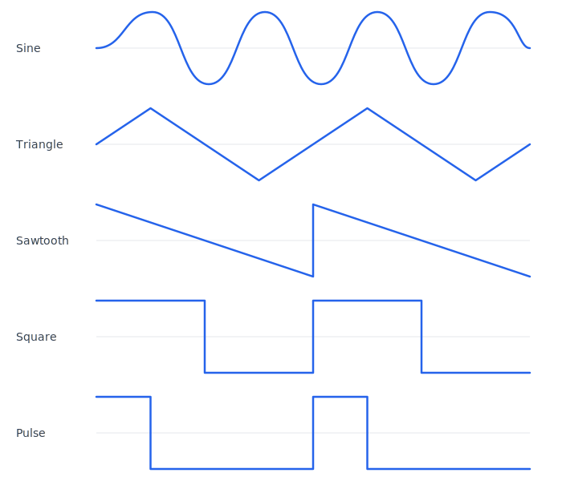
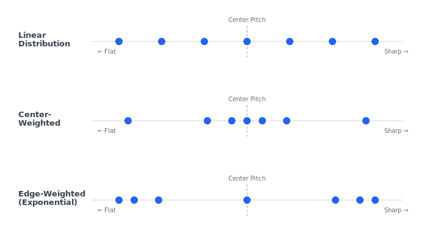

# Oscillators And Sound Sources

Oscillators and sound sources provide the raw material of synthesis. Filters, envelopes, effects, and modulation can shape that material, but the source determines the starting spectrum and behavior.

## Oscillator

An oscillator is a signal generator that produces a repeating waveform.

Why it matters:

- It defines the basic pitch and harmonic content of a sound.
- It is usually the first audible part of a subtractive synthesizer voice.
- Its quality affects the entire instrument.

Musical importance:

A good oscillator should feel stable, tunable, and clean when needed, but it should also support character through detune, phase behavior, sync, drift, and modulation.

## Waveform

A waveform is the shape of one cycle of an oscillator.

Why it matters:

- The waveform shape determines harmonic content.
- Different waveforms suggest different musical roles.
- Modulating waveform shape can create motion.

## Sine Wave

A sine wave contains only one frequency component: the fundamental.

Sound character:

- Pure.
- Smooth.
- Hollow if isolated.
- Useful for sub bass and test tones.

Importance:

- Foundation of additive synthesis.
- Foundation of many FM sounds.
- Useful as a clean sub-oscillator.
- Useful for LFO shapes.

Design implication:

Sine waves should be accurate and free from unnecessary harmonics. They are also useful as a reference for tuning and level behavior.

## Triangle Wave

A triangle wave contains mostly odd harmonics that decrease quickly in level.

Sound character:

- Soft.
- Rounded.
- More harmonic than sine.
- Less bright than square or saw.

Importance:

- Good for mellow leads and basses.
- Useful when a sine is too plain but a square is too strong.
- Common in classic analog-style synthesis.

Design implication:

Triangle waves are useful for musical variety and should be included early.

## Sawtooth Wave

A sawtooth wave contains both even and odd harmonics.

Sound character:

- Bright.
- Buzzing.
- Dense.
- Classic synthesizer tone.

Importance:

- Core source for subtractive basses, leads, brass, pads, and strings.
- Excellent for filtering because it contains many harmonics to remove or emphasize.

Design implication:

Sawtooth oscillators must be band-limited. A naive sawtooth aliases strongly, especially at high notes.

## Square Wave

A square wave contains odd harmonics.

Sound character:

- Hollow.
- Reedy.
- Strong.
- Focused.

Importance:

- Useful for basses, leads, chiptune-like tones, clarinet-like sounds, and pulse-width modulation variants.

Design implication:

Square waves also need band-limiting. They have sharp transitions that create many high harmonics.

## Pulse Wave

A pulse wave is like a square wave with adjustable duty cycle. The duty cycle describes how much of the cycle is high versus low.

Sound character:

- Hollow at 50 percent duty cycle.
- Thinner as the pulse narrows.
- Animated when pulse width is modulated.

Importance:

- Pulse-width modulation is one of the classic ways to create motion from a simple oscillator.
- Narrow pulses can create nasal, biting, or reedy tones.

Design implication:

Pulse width should have safe limits. Extremely narrow pulses can cause level changes, aliasing, and unstable-sounding results.

## Noise

Noise is a random or pseudo-random signal rather than a pitched periodic waveform.

Types:

- White noise has equal energy per hertz.
- Pink noise has more low-frequency energy and sounds smoother.
- Brown noise has even stronger low-frequency emphasis.
- Sample-and-hold noise changes at discrete intervals and is often used as a stepped modulation source.

Sound character:

- Air.
- Hiss.
- Breath.
- Impact.
- Texture.
- Randomness.

Importance:

- Essential for drums, wind, breath, risers, sweeps, and attack transients.
- Useful as both audio and modulation source.

Design implication:

Noise should be level-managed carefully because it can dominate a mix. Filtered noise is often more musically useful than raw noise.

## Sub-Oscillator

A sub-oscillator produces a pitch below the main oscillator, usually one or two octaves lower.

Why it matters:

- Adds weight to basses and leads.
- Can reinforce the fundamental.
- Helps a patch remain powerful on small speakers if balanced carefully.

Design implication:

Sub-oscillators should avoid uncontrolled low-frequency buildup. They should have clear level control.

## Detune

Detune is a small pitch offset between oscillators or voices.

Why it matters:

- Creates beating and width.
- Makes static tones feel alive.
- Supports unison, chorus-like effects, and analog-style instability.

Musical importance:

Small detune can sound warm. Large detune can sound wide, aggressive, or out of tune.

Design implication:

Detune should be scaled musically. Fine detune is usually measured in cents. Coarse tuning is usually measured in semitones or octaves.

## Unison

Unison means several oscillators or voice copies play the same note with slight differences in pitch, phase, pan, or tone.

Why it matters:

- Creates width and density.
- Common in modern basses, leads, and pads.
- Can quickly increase level and CPU cost.

Design implication:

Unison needs gain compensation, detune control, stereo spread, and phase behavior rules.

## Detune Distribution And Curves

Detune distribution describes how the pitch offset is spread across the unison voices. When several voices play the same note, each one is shifted slightly sharp or flat relative to the center pitch. The distribution curve controls how those offsets are spaced.

Linear spacing places voices at equal pitch intervals above and below the center. This produces an even spread that is easy to predict and sounds uniformly wide. Exponential spacing pushes the outer voices farther apart while keeping inner voices closer to the center, which emphasizes the edges and can sound more dramatic. Center-weighted spacing clusters most voices near the center pitch with only a few at the extremes, which preserves pitch clarity while still adding thickness.

Why it matters:

- The curve shape determines whether unison sounds like a tight chorus or a wide wall.
- Linear spacing can sound mechanical because every voice contributes equal beating.
- Center-weighted spacing keeps the fundamental pitch clear, which helps melodic parts stay defined.
- Exponential spacing produces a wider stereo impression but can blur the perceived pitch.

Controls typically exposed:

- Detune amount, which sets the total pitch range across the voices.
- Curve shape selector or a single parameter that morphs between center-weighted and edge-weighted distributions.

Design implication:

The detune curve is as important as the detune amount. Two patches with the same detune amount but different curves will sound noticeably different. The synthesizer should treat distribution shape as a first-class parameter rather than hiding it behind a single detune knob.

## Unison Gain Compensation

Gain compensation is the practice of reducing per-voice level as unison voice count increases. When multiple voices are summed, the combined output is louder than a single voice. Without correction, enabling unison or raising the voice count causes a sudden level jump that disrupts the balance of a patch.

The simplest approach is to divide each voice's amplitude by the number of voices, but this can make high-count unison feel quieter than expected because detuned voices partially cancel each other at some frequencies. A more musical approach scales level by a factor between one-over-count and one, tuned by ear or by an empirical curve.

Why it matters:

- Without compensation, switching from two unison voices to eight produces a large level increase.
- Patches become inconsistent when the user experiments with voice count.
- Downstream processing like distortion and compression responds differently to level changes, so an uncompensated jump can alter the tone of the entire chain.
- Perceived loudness does not scale linearly with summed amplitude because detuned voices interact through beating and partial cancellation.

Controls typically exposed:

- Automatic compensation that adjusts silently based on voice count.
- An optional manual trim that lets the user bias the compensation toward louder or quieter results.

Design implication:

Gain compensation should be built into the unison system rather than left to the user. The goal is that changing the voice count changes the character of the sound without changing its overall loudness. Poor compensation is one of the most common reasons unison patches feel unpredictable.

## Unison Phase Relationships

Phase relationship describes where each unison voice begins its waveform cycle when a note starts. The three common behaviors are phase-aligned, random phase, and spread phase.

Phase-aligned means every unison voice starts at the same point in the cycle. This produces a strong, consistent attack because all voices reinforce each other at the moment of onset. However, the initial instant sounds like a single loud voice before the detune creates audible separation, which can make the attack feel narrow.

Random phase means each voice starts at an unpredictable point. This produces variation from note to note, which sounds organic but makes the attack less consistent. Some notes may feel punchy while others feel softer depending on how the random phases happen to align.

Spread phase distributes starting positions evenly across the cycle. This produces an immediately wide sound from the first sample because the voices are already separated. The tradeoff is a softer, less defined attack.

Why it matters:

- Phase behavior determines whether a unison patch sounds tight and punchy or wide and diffuse at note onset.
- Drums and basses often benefit from phase-aligned starts for a reliable transient.
- Pads and ambient textures often benefit from spread or random phase for instant width.
- The choice interacts with stereo spread: random phase combined with stereo panning creates the widest image but the least mono compatibility.

Controls typically exposed:

- A phase mode selector offering aligned, random, and spread options.
- Optionally a per-note randomness amount that blends between deterministic and random behavior.

Design implication:

Phase behavior should be a deliberate per-patch choice rather than an implementation accident. The synthesizer should define and document which phase rule applies and ideally allow the user to select one. Consistent phase behavior is especially important for patches that rely on strong transients.

## Supersaw

A supersaw is a specific application of unison built from multiple detuned sawtooth oscillators layered together. The name comes from the Roland JP-8000, which introduced a single oscillator mode that internally generated several sawtooth voices with adjustable detune. It has since become one of the most recognized sounds in electronic music, particularly in trance, EDM, and modern pop production.

What distinguishes a supersaw from generic unison is the combination of the sawtooth waveform's dense harmonic content with carefully tuned detune and stereo spread. A sawtooth already contains every harmonic, so layering and detuning multiple sawtooths produces rich beating across the entire spectrum rather than at isolated harmonics.

Why it matters:

- The supersaw is a foundational sound that users expect from any modern synthesizer.
- It demonstrates how unison parameters interact: voice count sets density, detune amount sets width and motion, detune curve sets character, and stereo spread sets spatial image.
- It is a practical test case for the quality of the unison system because small flaws in gain compensation, phase behavior, or detune distribution become obvious in a supersaw patch.

Key parameters: voice count, detune amount, detune curve shape, and stereo spread. Higher voice counts increase density but with diminishing musical returns beyond seven to nine voices. Detune amount should stay moderate for musical results; excessive detune causes the pitch center to blur and chords become muddy.

Common mistakes:

- Too much detune, which makes the sound wobbly and pitch-unstable rather than wide.
- Stereo spread that collapses or cancels when summed to mono, making the patch unusable in many playback systems.
- Excessive voice count without adjusting gain compensation, causing clipping or tonal change from downstream saturation.

Design implication:

The supersaw should be achievable through the general unison and oscillator system rather than requiring a special mode. If the unison system handles detune distribution, gain compensation, phase behavior, and stereo spread correctly, a convincing supersaw emerges naturally from selecting a sawtooth waveform and raising the unison count.

## Unison And Processing Cost

Every unison voice is a full copy of the oscillator and typically runs through the same filter, modulation, and effects path as the original voice. This means that a patch with eight-voice unison on a four-note chord requires the processing resources of thirty-two independent oscillator and filter instances.

Why it matters:

- Unison is the single fastest way to multiply the processing demands of a synthesizer voice.
- A design that allows high unison counts without accounting for the cost will hit real-time audio limits under polyphonic use.
- The cost is not only in the oscillator: each unison voice may also need its own filter state, envelope state, and modulation computation.

Strategies at the design level:

- Quality modes that automatically reduce unison count when polyphony is high, trading per-voice richness for more simultaneous notes.
- A maximum unison voice limit that the architecture enforces globally, preventing runaway resource use.
- Simplified processing for unison voices, where only the primary voice receives full modulation and the additional voices receive a reduced version. This saves cost but changes the character of the sound because modulation differences between unison voices contribute to movement.
- Allowing the user to choose between full per-voice processing and shared processing as an explicit quality setting.

Design implication:

Unison cost is an architectural decision, not merely an optimization concern. The voice allocation system, the modulation routing, and the effects chain all need to account for the possibility that a single note may expand into many internal voices. This should be considered during the design phase so that the voice budget and resource limits are coherent from the start.

## Oscillator Sync

Oscillator sync resets one oscillator's phase using another oscillator.

Why it matters:

- Produces strong, bright, harmonically complex tones.
- Sync sweeps create classic aggressive lead sounds.

Musical importance:

Sync is useful for ripping leads, hard-edged basses, and animated timbres.

Design implication:

Sync can produce extreme high-frequency content and aliasing. It should be treated as a quality-sensitive feature.

## Phase Reset And Free-Running Phase

Phase reset means an oscillator starts each note from a defined phase. Free-running phase means oscillator phase continues independently and each note begins wherever the oscillator happens to be.

Phase reset:

- Produces consistent attacks.
- Useful for drums, basses, and precise transients.
- Can sound static in repeated notes.

Free-running phase:

- Feels more organic.
- Creates variation between notes.
- Can make attacks less predictable.

Design implication:

The synth should eventually expose or define phase behavior per oscillator or per patch.

## Drift

Drift is slow, subtle variation in pitch, phase, or tone.

Why it matters:

- Adds life to otherwise static digital oscillators.
- Helps emulate analog instability when desired.

Design implication:

Drift should be controllable and musically bounded. Too much drift sounds out of tune.

## Wavetable Source

A wavetable source reads from one-cycle waveforms and can move between them.

Why it matters:

- Adds evolving timbres beyond static waveforms.
- Makes modulation visually and musically compelling.

Design implication:

Wavetable position should be a modulation destination. Movement should be smooth unless stepped movement is intentional.

## Sample Source

A sample source plays recorded audio.

Why it matters:

- Captures complex real-world detail.
- Provides attacks, textures, and organic variation.

Design implication:

Sample loading and analysis should be non-real-time. Playback behavior should include root note, looping, start position, and pitch behavior if sample synthesis is added.

## Granular Source

A granular source produces many short grains from a sample or buffer.

Why it matters:

- Creates textures that are difficult with normal oscillators.
- Allows time, pitch, and density to become separate design dimensions.

Design implication:

Granular synthesis needs careful parameter design because grain duration, density, pitch, position, and envelope interact strongly.

## Source Design Recommendations

For the first architecture:

- Include sine, triangle, saw, square, pulse, and noise.
- Include at least two pitched oscillators and one noise source conceptually.
- Include oscillator level, tuning, detune, phase behavior, and waveform selection.
- Treat band-limiting as required, not optional polish.
- Keep future sources modular so wavetable, FM, sample, and granular sources can fit later.

